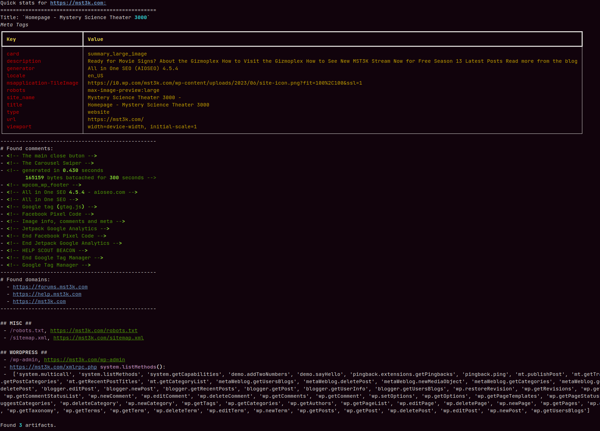

# sitedat

A web interrogation tool for nosy jerks.

Hardly a new tool, but I felt the itch, and so it went. There are better, safer, more comprehensive tools out there to do this.

-   Interrogates a list of files and directories on a web server.
-   Dumps all the comments in the HTML.
-   Dumps additional file paths and domains found.
-   Calls optional additional handlers if a particular entry is found; for instance, it currently checks if `/xmlrpc.php` returns some basic info if `/wp-admin` is found.
-   The legality of this tool comes down to where you live and your personal ethics.

## Modifying

-   Edit `TARGETS` in `/app/targets.py` to add/remove entries and sections.
-   If a section is a dictionary, it must contain two properties:
    -   `handler` - this is called when any of the entries in the adjacent `files` dictionary are found.
    -   `files` - dictionary of files, where the key is the filename and the value is the optional handler function.
    -   All functions are optional; just set them to `None`.
    -   Check the "WordPress" section for a working example of this.

## Contrib

-   No contributions are being accepted for this project.
-   Issues with reproducible details are encouraged.
-   No support is being provided.
-   Feel free to fork. It's not a complicated project.

